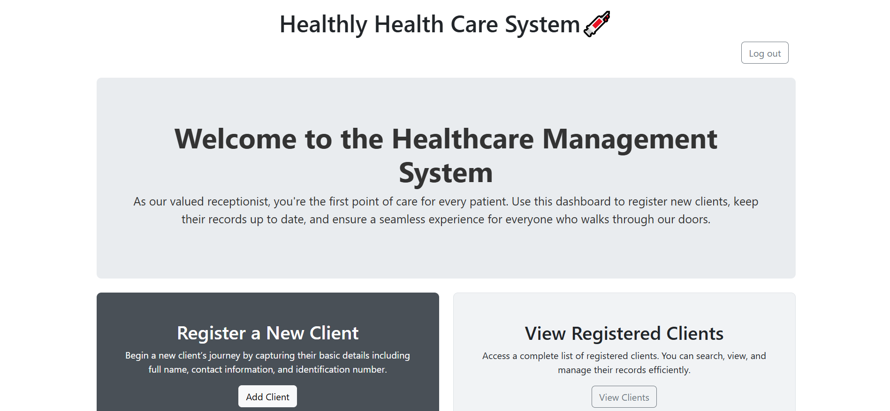
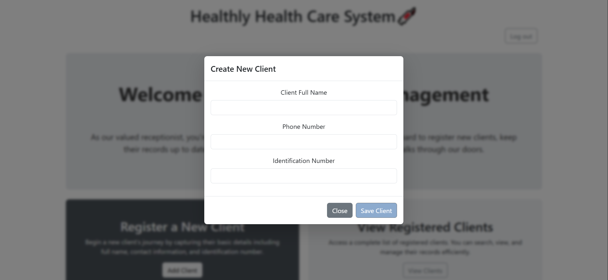
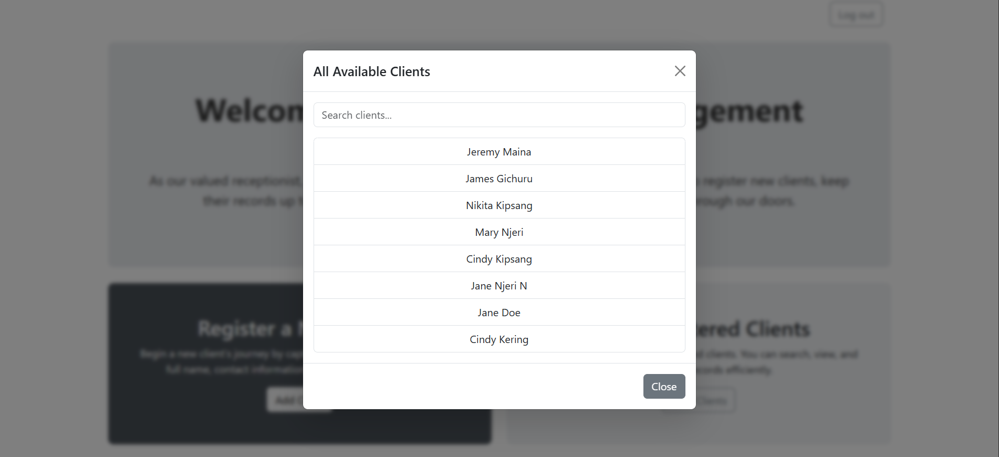
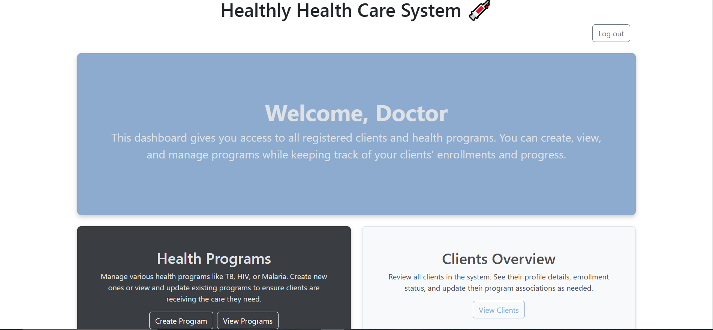
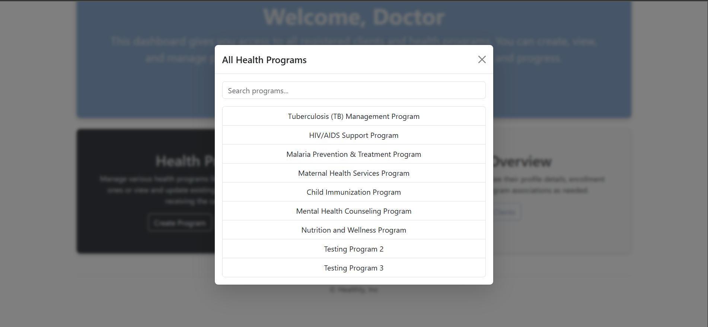
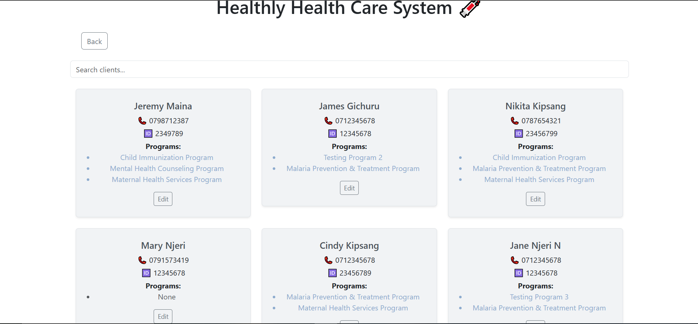

# 🏥 Healthcare Management System

A full-stack healthcare management system built with **React (Vite)** and **Express.js**, backed by **PostgreSQL**.  
This platform is designed to streamline clinic operations by enabling receptionists to register clients and doctors to manage health programs and assign them to individual clients.

---

## ✨ Features

### 🧾 Receptionist Dashboard
- Register new clients with full name, phone number, and ID
- View and search all registered clients
- Intuitive modal interface for adding clients

### 🩺 Doctor Dashboard
- Create and manage health programs (e.g., TB, HIV, Malaria)
- Assign one or multiple programs to each client
- View and search through assigned client programs
- Clean UI design with soft gray and muted blue (`#8DABCE`) theme for low eye strain

---

## 📁 Project Structure

```
/client        # Frontend (React with Vite)
/backend       # Backend (Express.js)
/database      # SQL setup (tables and seed data)
```

---

## ⚙️ Tech Stack

- **Frontend:** React (Vite), Bootstrap
- **Backend:** Express.js, Node.js
- **Database:** PostgreSQL
- **Other Tools:** Vite, pg, bcrypt, dotenv, cors

---

## 🚀 Getting Started

### 🛠 Backend Setup

1. Navigate to the backend directory:
   ```bash
   cd backend
   ```

2. Install dependencies:
   ```bash
   npm install
   ```

3. Start the server:
   ```bash
   node server.js
   ```

> The backend will run on:  
> `http://localhost:8000`

---

### 🎨 Frontend Setup (Vite)

1. Navigate to the frontend directory:
   ```bash
   cd client
   ```

2. Install dependencies:
   ```bash
   npm install
   ```

3. Run the development server:
   ```bash
   npm run dev
   ```

> The frontend will run on:  
> `http://localhost:5173`

---

## 🤝 Acknowledgments

This project was developed as part of an interview assignment and serves as a portfolio piece demonstrating:

- Full-stack development (React + Express)
- Relational database design with PostgreSQL
- Security features such as password hashing and role authorization.
- RESTful API architecture
- UI/UX best practices
- Vite-based frontend tooling

---

## 📬 Contact

Made with 💙 by **Charity Nyamamba**

- 📧 Email: [nyamambanyaguch@gmail.com](mailto:nyamambanyaguch@gmail.com)
- 🌐 LinkedIn: [Charity](https://www.linkedin.com/in/charity-nyamamba/)


---

## 📸 Screenshots

> Receptionist HomepageDashboard 
> Recetionist Add Clients Functionality 
> Clients from receptionist's page 
> Doctor's homepage 
> Doctor's health programs 
> Client's view from doctor's page 

---