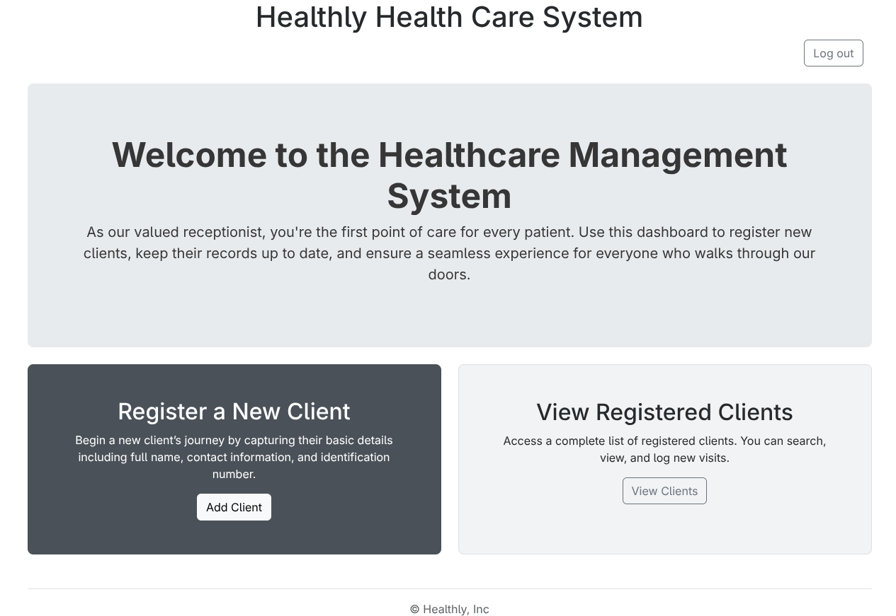
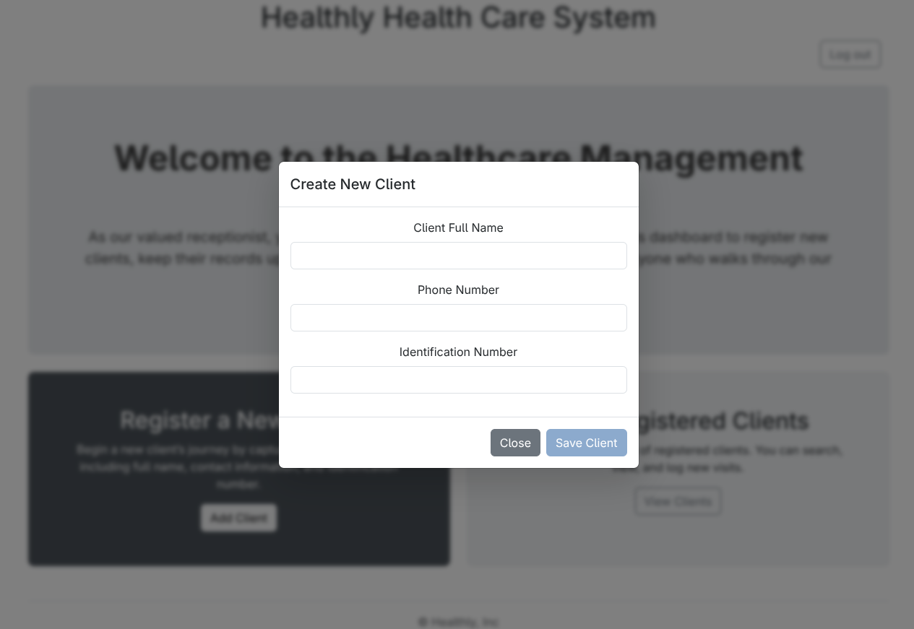
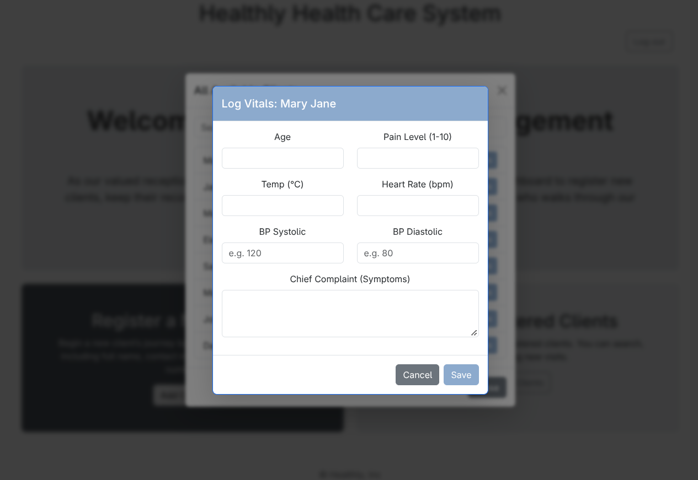
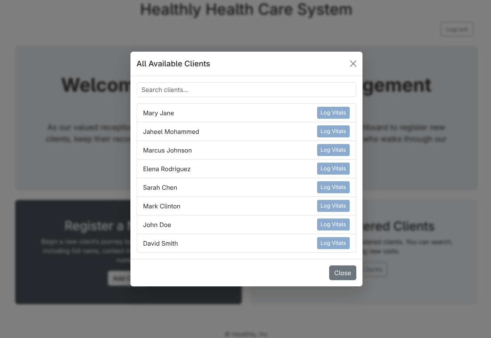
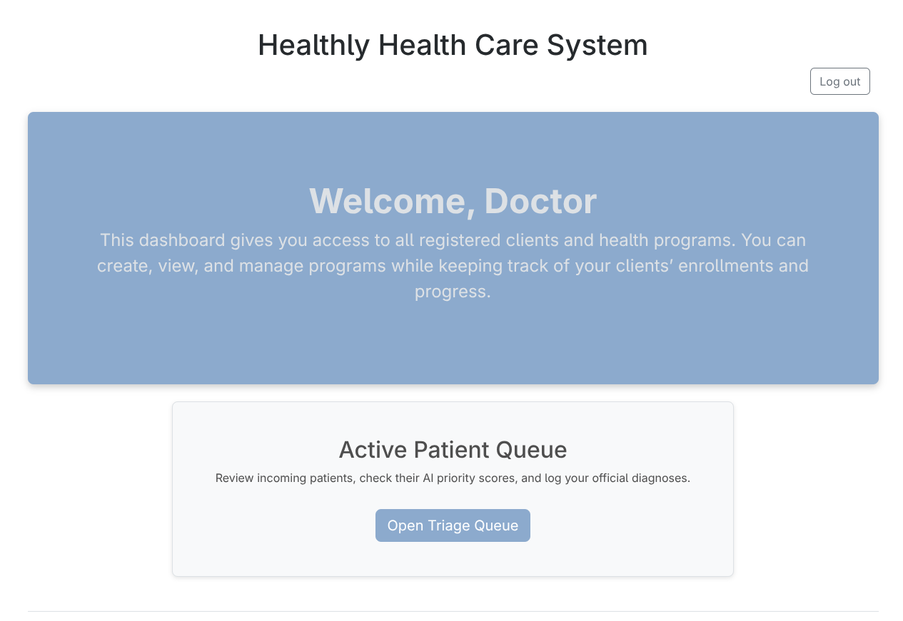
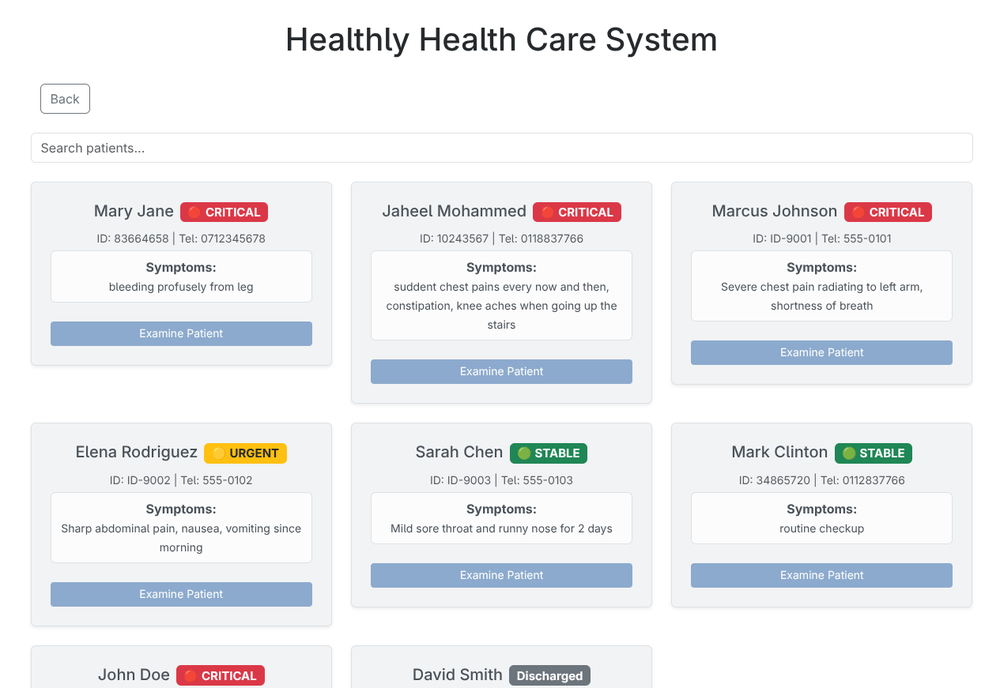

# Intelligent Healthcare Management System (IHMS)

An AI-powered healthcare portal that automates patient intake and utilizes machine learning to dynamically triage and prioritize doctor queues based on real-time clinical vitals and symptom analysis.

By shifting from a traditional monolithic structure to a microservice architecture, this system ensures that critical patients are instantly routed to the top of the clinical queue, reducing wait times for life-threatening emergencies.

## System Architecture & Clinical Workflow

The application operates on a 3-tier microservice architecture:

1. **Patient Intake (React UI):** The Receptionist logs the patient's vitals (Age, Temp, Heart Rate, BP, Pain Level) and unstructured symptoms (Chief Complaint).
2. **The API Gateway (Express.js):** Acts as an interceptor. It receives the intake payload, pauses the database transaction, and makes a secure HTTP call to the AI Microservice.
3. **The Inference Engine (FastAPI):** A lightweight Python server that runs the payload through a trained Random Forest model, calculates the triage priority (Critical, Urgent, or Stable), and returns the score.
4. **Data Persistence (PostgreSQL):** Express appends the AI's priority score to the patient record and securely saves it to the database.
5. **Clinical Examination:** The Doctor's dynamic dashboard automatically reorders itself, pushing `🔴 CRITICAL` patients to the top. The doctor can then examine the patient, log an official diagnosis and treatment plan, and discharge them from the active queue.

## AI & Machine Learning Pipeline

The AI inference engine was trained on the real-world **KTAS (Korean Triage and Acuity Scale)** clinical dataset.

* **Model:** Scikit-Learn `RandomForestClassifier` utilizing an ensemble of 100 decision trees to prevent overfitting and ensure high clinical precision.
* **Natural Language Processing:** Implemented a `TfidfVectorizer` (Term Frequency-Inverse Document Frequency) to translate unstructured text (e.g., "severe chest pain radiating to left arm") into quantifiable math features.
* **Data Imputation:** Real-world hospital data is messy. The pipeline utilizes a `SimpleImputer` (median strategy) to gracefully handle missing vital signs (like unrecorded blood pressure) without crashing the inference engine.

## Tech Stack

* **Frontend:** React (Vite), Bootstrap
* **Backend (API Gateway):** Node.js, Express.js, JWT Authentication, bcrypt
* **Backend (AI Microservice):** Python, FastAPI, Uvicorn
* **Machine Learning:** Scikit-Learn, Pandas, Joblib
* **Database:** PostgreSQL (Relational schema with normalized tables)

## 🛠️ Local Setup & Installation

Because this is a microservice architecture, you will need to run the Frontend, the Express API, and the Python AI server concurrently.

**1. Clone the repository**

```bash
git clone git@github.com:Cnnb01/Healthcare-system.git
cd healthcare-system

```

**2. Start the AI Microservice (Port 8001)**

```bash
cd ai-triage-service
python3 -m venv venv
source venv/bin/activate  # On Windows use: venv\Scripts\activate
pip install -r requirements.txt
uvicorn main:app --reload --port 8001

```

**3. Start the Express API Gateway (Port 8000)**

```bash
# Open a new terminal
cd backend
npm install
# Ensure PostgreSQL is running and your database credentials are set
npm start / nodemon server.js(if nodemon is installed)

```

**4. Start the React Frontend (Port 5173)**

```bash
# Open a new terminal
cd frontend
npm install
npm run dev

```

## 📸 Screenshots

> Receptionist HomepageDashboard 
> Receptionist Add Clients Functionality 
> Receptionist Log Vitals Functionality 
> View clients from receptionist's page 
> Doctor's homepage 
> Triage Queue 

---